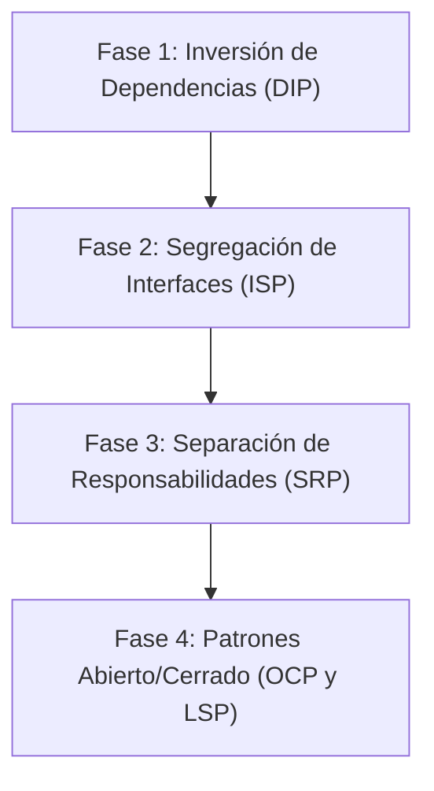

# 🏛️ AUDITORÍA INTEGRAL DE ARQUITECTURA Y ANÁLISIS DE PRINCIPIOS SOLID
## Proyecto: TecnoTaller Backend API (Express + TypeScript + Supabase)

> **Alcance Absoluto:**  
> Este documento audita el **100% de los componentes del backend**: los 18 módulos de negocio, los 3 endpoints de infraestructura del sistema (`/healthcheck`, `/openapi.json`, `/docs`), los 4 middlewares compartidos (`auth`, `authorizeRoles`, `errorHandler`, `asyncHandler`), y los 48 endpoints REST de la API. No se omite ningún archivo ni funcionalidad.

---

## 📌 1. Marco Teórico: Los Principios SOLID en Backend Web

| Principio | Sigla | Definición Operativa en esta API |
|---|---|---|
| **Single Responsibility** | **SRP** | Cada clase, servicio o controlador debe tener una única razón para cambiar. Debe atender a un solo actor/responsabilidad (no mezclar lógica de negocio con infraestructura, formateo HTTP, o validación de esquemas). |
| **Open / Closed** | **OCP** | Las entidades de software deben estar abiertas para su extensión pero cerradas para su modificación (usar polimorfismo, estrategias y adaptadores en lugar de `switch`/`if-else` o mapas estáticos). |
| **Liskov Substitution** | **LSP** | Los subtipos o implementaciones de una interfaz deben poder sustituir a sus tipos base sin alterar el comportamiento esperado del sistema ni lanzar excepciones inesperadas o alterar contratos de tipos. |
| **Interface Segregation** | **ISP** | Los clientes no deben ser forzados a depender de interfaces o contratos que no utilizan. Es preferible tener interfaces pequeñas y cohesivas que interfaces monolíticas ("God Interfaces"). |
| **Dependency Inversion** | **DIP** | Los módulos de alto nivel no deben depender de módulos de bajo nivel; ambos deben depender de abstracciones. Las abstracciones no deben depender de detalles; los detalles deben depender de abstracciones. |

---

## 🔍 2. Falencias Transversales Sistémicas (Afectan a Toda la Aplicación)

### 🔴 Falencia Global 1: Violación Radical de DIP (Acoplamiento al Singleton de Supabase)
- **Evidencia:** Todos los repositorios (`ProductRepository`, `WorkOrderRepository`, `AppointmentRepository`, `DiagnosticRepository`, `CustomerRepository`, etc.) importan directamente:
  ```typescript
  import { supabase } from '../../config/supabase';
  ```
- **Problema:** Los repositorios están rígidamente acoplados al cliente concreto de Supabase JS SDK. No es posible cambiar de proveedor de base de datos (PostgreSQL nativo con Prisma/Drizzle, MySQL, o un mock en memoria) sin reescribir todos los repositorios.
- **Principio Violado:** **DIP** (Módulos de acceso a datos dependen de una instancia concreta global y no de una abstracción de conexión o cliente de base de datos inyectado).

### 🔴 Falencia Global 2: Composition Root Inexistente / Acoplamiento en Rutas (DIP & SRP)
- **Evidencia:** En las funciones `createXRouter()`, se instancian manualmente las dependencias en cascada:
  ```typescript
  const repository = new WorkOrderRepository();
  const service = new WorkOrderService(repository, guidGenerator);
  const controller = new WorkOrderController(service);
  ```
- **Problema:** No existe un contenedor de Inyección de Dependencias (IoC Container como Inversify, Awilix o NestJS DI). Las rutas no solo definen endpoints, sino que gobiernan el ciclo de vida y ensamblado de objetos. Si un servicio añade una dependencia (ej: un logger o un notifier), hay que modificar las rutas y tests manuales.
- **Principio Violado:** **DIP** y **SRP** (las rutas asumen la responsabilidad de composition root).

### 🔴 Falencia Global 3: Controladores Acoplados a Express (SRP)
- **Evidencia:** Los controladores reciben directamente `(req: Request, res: Response)` de Express y manipulan el flujo HTTP directamente (`res.json()`, `res.status()`).
- **Problema:** Los controladores no pueden reutilizarse en otros contextos (CLI, WebSockets, cron jobs, AWS Lambda, microservicios) porque dependen del objeto `Response` de Express.
- **Principio Violado:** **SRP** (El controlador mezcla la orquestación de casos de uso con la serialización del protocolo HTTP).

### 🔴 Falencia Global 4: Pipeline de Errores Cerrado a Extensión (OCP)
- **Evidencia:** En `src/shared/middlewares/error-handler.ts`:
  ```typescript
  if (err instanceof AppError) { ... }
  if (err instanceof ZodError) { ... }
  // Todo lo demás cae a 500 INTERNAL_ERROR
  ```
- **Problema:** Los errores de base de datos de Postgres/Supabase (`22P02`, `23503`, `PGRST205`, `42P01`) no son reconocidos como errores de dominio, colapsando en respuestas `500 INTERNAL_ERROR` no controladas salvo que se parchen manualmente en cada repositorio.
- **Principio Violado:** **OCP** (Para soportar un nuevo tipo de error hay que modificar el cuerpo del handler central).

---

## 🔬 3. Análisis Exhaustivo Módulo por Módulo (18 Módulos de Negocio)

---

### 1️⃣ Módulo de Autenticación (`/api/v1/auth`)
- **Endpoints:**
  - `POST /auth/login`
  - `POST /auth/register`
  - `GET /auth/me`
- **Clases:** `AuthController`, `AuthService`, `AuthRepository`

#### Falencias SOLID Detectadas:
1. **SRP (Responsabilidad Única) - Violación en `authMiddleware`**:
   - `src/shared/middlewares/auth.ts` mezcla validación de JWT con lógica de simulación de usuarios locales (`token.startsWith('dev-')`), asignando roles por coincidencia de subcadena (`token.includes('admin')`) y UUIDs en hardcode.
2. **DIP (Inversión de Dependencias) - Violación en `AuthRepository`**:
   - Dependencia rígida de `supabase.auth.signInWithPassword` y `supabase.auth.signUp`. Imposibilita migrar a Auth0, Firebase, Keycloak o JWT propios con Argon2/Bcrypt sin reescribir el repositorio.
3. **OCP (Abierto/Cerrado) - Violación en `authorizeRoles`**:
   - Verificación estática con listas de strings (`ROLES.ADMINISTRADOR`, `ROLES.TECNICO`). No hay abstracción de permisos ni RBAC/ABAC dinámico. Agregar un rol requiere editar manualmente las rutas.

---

### 2️⃣ Módulo de Órdenes de Trabajo (`/api/v1/work-orders`)
- **Endpoints:**
  - `GET /work-orders`
  - `POST /work-orders`
  - `GET /work-orders/:id`
  - `GET /work-orders/track/:guideNumber`
  - `PATCH /work-orders/:id/status`
  - `POST /work-orders/:id/exit-register`
  - `GET /work-orders/:id/history`
- **Clases:** `WorkOrderController`, `WorkOrderService`, `WorkOrderRepository`, `WorkOrder` (Entity)

#### Falencias SOLID Detectadas:
1. **SRP (Responsabilidad Única) - Violación Crítica en `WorkOrderController`**:
   - `WorkOrderController` instancia `ActivityRepository` y `ActivityService` en su propio constructor para atender rutas hijas de bitácora, rompiendo la separación de módulos.
2. **SRP & ISP - Violación en `IWorkOrderRepository`**:
   - "God Interface": reúne creación, búsqueda por guía, filtros complejos, historial de estados, fotos y comprobaciones de integridad relacional en un solo contrato masivo.
3. **OCP (Abierto/Cerrado) - Violación en Máquina de Estados**:
   - Las transiciones de estado de `OrderStatus` (`INGRESADO` -> `EN_REVISION` -> `ESPERANDO_REPUESTO` -> `EN_REPARACION` -> `REPARADO` -> `LISTO_PARA_ENTREGA` -> `ENTREGADO`) están codificadas en un mapa estático dentro de la entidad `WorkOrder`. No se usa el patrón **State**.

---

### 3️⃣ Módulo de Actividades de Órdenes (`/api/v1/work-orders/:id/activities`)
- **Endpoints:**
  - `POST /work-orders/:id/activities`
  - `GET /work-orders/:id/activities`
- **Clases:** `ActivityController`, `ActivityService`, `ActivityRepository`

#### Falencias SOLID Detectadas:
1. **SRP (Responsabilidad Única) - Doble Responsabilidad en `ActivityRepository`**:
   - Mezcla el acceso a datos en Supabase Postgres con una caché volátil en memoria (`inMemoryActivities = new Map<string, Activity[]>()`). El repositorio es base de datos y memoria caché al mismo tiempo.
2. **LSP (Sustitución de Liskov) - Inconsistencia de Identificadores**:
   - Cuando la tabla en Supabase no existe, genera IDs con formato `act-${Date.now()}` en vez de UUIDs v4, rompiendo el contrato del tipo `id: string (UUID)`.

---

### 4️⃣ Módulo de Fotos de Órdenes (`/api/v1/work-orders/:id/photos`)
- **Endpoints:**
  - `POST /work-orders/:id/photos`
  - `GET /work-orders/:id/photos`
- **Clases:** `PhotoController`, `PhotoService`, `PhotoRepository`

#### Falencias SOLID Detectadas:
1. **SRP (Responsabilidad Única) - Duplicidad Funcional**:
   - `WorkOrderService` incluye un método `addPhoto` y `PhotoService` incluye otro método `upload`. Dos módulos gestionan la misma funcionalidad de formas diferentes.
2. **DIP (Inversión de Dependencias)**:
   - `PhotoRepository` depende directamente del bucket `supabase.storage`. No existe la abstracción `IStorageProvider` para admitir S3, Cloudinary o MinIO.

---

### 5️⃣ Módulo de Productos y Kardex (`/api/v1/products`)
- **Endpoints:**
  - `GET /products`
  - `GET /products/admin/all`
  - `GET /products/:id`
  - `POST /products`
  - `PUT /products/:id`
  - `PATCH /products/:id/availability`
  - `GET /products/:id/movements`
  - `POST /products/:id/movements`
- **Clases:** `ProductController`, `ProductService`, `ProductRepository`, `Product` (Entity)

#### Falencias SOLID Detectadas:
1. **SRP (Responsabilidad Única) - Catálogo Comercial vs Kardex Contable**:
   - `ProductService` administra datos de exhibición de tienda (imágenes, specs, precio venta) y a la par ejecuta transacciones contables de inventario (movimientos IN/OUT y cálculo de costo medio).
2. **OCP (Abierto/Cerrado) - Tipos de Movimiento Rígidos**:
   - `InventoryMovementType` está restringido a `'IN' | 'OUT'`. No admite conceptos como `DEVOLUCION`, `MERMA`, `AJUSTE_AUDITORIA` o `TRANSFERENCIA` sin alterar el esquema y condicionales.
3. **ISP (Segregación de Interfaces)**:
   - `IProductRepository` contiene 8 métodos dispares. Clientes de catálogo público quedan atados a contratos que exponen movimientos de stock.

---

### 6️⃣ Módulo de Citas (`/api/v1/appointments`)
- **Endpoints:**
  - `GET /appointments`
  - `POST /appointments`
  - `PATCH /appointments/:id/status`
- **Clases:** `AppointmentController`, `AppointmentService`, `AppointmentRepository`

#### Falencias SOLID Detectadas:
1. **SRP (Responsabilidad Única) - Lógica de Sanitización en el Esquema**:
   - El archivo `appointments.types.ts` contiene funciones de normalización de formatos de fecha ('DD-MM-YYYY' vs ISO) dentro del esquema Zod, mezclando validación con formateo cultural de infraestructura.
2. **OCP (Abierto/Cerrado) - Ausencia de Reglas de Transición**:
   - Los estados (`pendiente`, `confirmada`, `cancelada`, `completada`) se mutan directamente sin validar transiciones válidas en el servicio.

---

### 7️⃣ Módulo de Diagnósticos Técnicos (`/api/v1/work-orders/:id/diagnostics`)
- **Endpoints:**
  - `GET /work-orders/:id/diagnostics`
  - `POST /work-orders/:id/diagnostics`
  - `GET /work-orders/:id/diagnostics/:diagnosticId`
  - `PUT /work-orders/:id/diagnostics/:diagnosticId`
  - `DELETE /work-orders/:id/diagnostics/:diagnosticId`
- **Clases:** `DiagnosticController`, `DiagnosticService`, `DiagnosticRepository`

#### Falencias SOLID Detectadas:
1. **DIP (Inversión de Dependencias) - Dependencia Concreta Inter-módulo**:
   - `DiagnosticService` recibe la clase concreta `WorkOrderRepository` en lugar de una interfaz desacoplada como `IWorkOrderValidator`.
2. **LSP (Sustitución de Liskov) - Inconsistencia de Soft-Delete**:
   - El método `delete` promete realizar un soft-delete, pero ante la falta de la columna `active` en la base de datos, ejecuta un borrado físico sin notificarlo en la firma.

---

### 8️⃣ Módulo de Servicios Técnicos (`/api/v1/services`)
- **Endpoints:**
  - `GET /services`
  - `POST /services`
  - `PUT /services/:id`
  - `DELETE /services/:id`
- **Clases:** `ServiceController`, `ServiceService`, `ServiceRepository`

#### Falencias SOLID Detectadas:
1. **SRP (Responsabilidad Única) - Contrato de Respuesta No Uniforme**:
   - Retorna `{ items: [...] }` sin soporte para paginación estandarizada (`PaginatedResult<T>`), obligando al frontend a implementar lógica condicional específica solo para este módulo.
2. **ISP (Segregación de Interfaces)**:
   - `ServiceService` no implementa una interfaz `IServiceService`, dificultando su sustitución por proxies de caché (Redis).

---

### 9️⃣ Módulo de Repuestos y Consumos (`/api/v1/parts`, `/api/v1/work-orders/:id/parts`)
- **Endpoints:**
  - `GET /parts`
  - `POST /parts`
  - `PUT /parts/:id`
  - `POST /work-orders/:id/parts`
- **Clases:** `PartController`, `PartService`, `PartRepository`

#### Falencias SOLID Detectadas:
1. **SRP (Responsabilidad Única) - Doble Dominio en `PartService`**:
   - Gestiona el inventario de repuestos y al mismo tiempo la asignación de repuestos a una orden de trabajo (`assignPart`), descontando stock y calculando precios.
2. **DIP (Inversión de Dependencias)**:
   - Acoplamiento directo con `WorkOrderRepository` en el constructor de `PartService`.

---

### 🔟 Módulo de Clientes (`/api/v1/customers`)
- **Endpoints:**
  - `GET /customers`
  - `GET /customers/:id`
  - `POST /customers`
  - `PUT /customers/:id`
- **Clases:** `CustomerController`, `CustomerService`, `CustomerRepository`

#### Falencias SOLID Detectadas:
1. **SRP (Responsabilidad Única) - Duplicidad de Identidad de Dominio**:
   - Coexisten la tabla `customers` y la tabla `users` (con `role: 'cliente'`). No hay sincronización ni unicidad de identidad entre quien tiene credenciales de acceso y quien deja un equipo en el taller.

---

### 1️⃣1️⃣ Módulo de Técnicos (`/api/v1/technicians`)
- **Endpoints:**
  - `GET /technicians`
  - `GET /technicians/:id`
  - `PATCH /technicians/:id`
  - `DELETE /technicians/:id`
- **Clases:** `TechnicianController`, `TechnicianService`, `TechnicianRepository`

#### Falencias SOLID Detectadas:
1. **SRP (Responsabilidad Única) - Desconexión del Ciclo de Vida**:
   - Al dar de baja a un técnico en este módulo, no se actualizan sus asignaciones pendientes en órdenes activas ni se sincroniza su registro de disponibilidad.
2. **OCP (Abierto/Cerrado)**:
   - Las especialidades o habilidades del técnico no están modeladas; cualquier técnico puede ser asignado a cualquier tipo de dispositivo sin validación de reglas de aptitud.

---

### 1️⃣2️⃣ Módulo de Disponibilidad de Técnicos (`/api/v1/technicians/:id/availability`)
- **Endpoints:**
  - `GET /technicians/:id/availability`
  - `PATCH /technicians/:id/availability`
- **Clases:** `TechnicianAvailabilityController`, `TechnicianAvailabilityService`, `TechnicianAvailabilityRepository`

#### Falencias SOLID Detectadas:
1. **SRP (Responsabilidad Única) - Fragmentación de Módulo**:
   - Este módulo existe como una carpeta separada a pesar de depender al 100% de la entidad `Technician`, generando dispersión de código para una misma entidad de negocio.
2. **OCP (Abierto/Cerrado)**:
   - El motivo de no disponibilidad es un campo de texto libre (`reason: string | null`) en lugar de un enum o estrategia de disponibilidad (vacaciones, turno, incapacidad, orden en curso).

---

### 1️⃣3️⃣ Módulo de Garantías (`/api/v1/work-orders/:id/warranty`, `/api/v1/warranties/validate/:id`)
- **Endpoints:**
  - `POST /work-orders/:id/warranty`
  - `GET /work-orders/:id/warranty`
  - `GET /warranties/validate/:id`
- **Clases:** `WarrantyController`, `WarrantyService`, `WarrantyRepository`

#### Falencias SOLID Detectadas:
1. **SRP (Responsabilidad Única) - Cálculo de Reglas de Negocio en Base de Datos**:
   - El cálculo de la fecha de expiración se delega a la consulta SQL o al repositorio en vez de encapsularse en un método de dominio `Warranty.calculateExpiration()`.
2. **DIP (Inversión de Dependencias)**:
   - Dependencia rígida de `WorkOrderRepository` en el servicio de garantías.

---

### 1️⃣4️⃣ Módulo de Solicitudes de Compra (`/api/v1/purchase-requests`)
- **Endpoints:**
  - `GET /purchase-requests`
  - `POST /purchase-requests`
  - `GET /purchase-requests/:id`
  - `PATCH /purchase-requests/:id/status`
- **Clases:** `PurchaseRequestController`, `PurchaseRequestService`, `PurchaseRequestRepository`

#### Falencias SOLID Detectadas:
1. **LSP (Sustitución de Liskov) - Polimorfismo Roto en Items**:
   - `PurchaseRequestItem` define campos opcionales `{ productId?: string; partId?: string; quantity: number }`. Obliga a comprobaciones manuales `if (item.productId) ... else if (item.partId) ...`, en lugar de una unión discriminada polimórfica.
2. **SRP (Responsabilidad Única) - Almacenamiento JSONB Desnormalizado**:
   - Almacena los ítems como un array JSONB dentro de la fila de la solicitud, eludiendo la integridad referencial de base de datos.

---

### 1️⃣5️⃣ Módulo de Inventario y Alertas (`/api/v1/inventory`)
- **Endpoints:**
  - `GET /inventory/low-stock`
- **Clases:** `InventoryController`, `InventoryService`, `InventoryRepository`

#### Falencias SOLID Detectadas:
1. **SRP (Responsabilidad Única) - Redundancia Funcional**:
   - `ProductService` ya implementa `listLowStock()`. Este módulo duplica la lógica de comprobación de umbrales para piezas y productos.
2. **OCP (Abierto/Cerrado)**:
   - El filtro `type: 'all' | 'products' | 'parts'` utiliza condicionales fijos. Si se añade inventario de herramientas o insumos, hay que modificar el servicio.

---

### 1️⃣6️⃣ Módulo de Reportes e Informes (`/api/v1/reports`)
- **Endpoints:**
  - `GET /reports/sales`
  - `GET /reports/revenue`
  - `GET /reports/trends`
- **Clases:** `ReportController`, `ReportService`, `ReportRepository`, 6 Clases `*ReportGenerator`

#### Falencias SOLID Detectadas:
1. **OCP (Abierto/Cerrado) - Violación en el Constructor de `ReportService`**:
   - Aunque usa el patrón Strategy, el constructor de `ReportService` instancia con `new` los 6 generadores fijos en un `Map`. Añadir un reporte requiere editar el código de la clase.
2. **ISP (Segregación de Interfaces)**:
   - `IReportRepository` es una interfaz masiva con métodos de ventas, órdenes, técnicos y repuestos. Los generadores solo usan una pequeña fracción de los métodos pero dependen de la interfaz completa.

---

### 1️⃣7️⃣ Módulo de Auditoría (`/api/v1/audit`)
- **Endpoints:**
  - `GET /audit`
- **Clases:** `AuditController`, `AuditService`, `AuditRepository`

#### Falencias SOLID Detectadas:
1. **SRP (Responsabilidad Única) - Falta de Interceptor Transversal**:
   - El módulo solo provee lectura de logs pero no provee un mecanismo automático (middleware/decorador) para interceptar y registrar las acciones de los demás módulos.
2. **DIP (Inversión de Dependencias)**:
   - `AuditRepository` depende rígidamente de Supabase; no existe una abstracción `IAuditSink` para dirigir los registros a Elasticsearch, Datadog o CloudWatch.

---

### 1️⃣8️⃣ Módulo de Notificaciones (`/api/v1/work-orders/:id/notifications`)
- **Endpoints:**
  - `GET /work-orders/:id/notifications`
- **Clases:** `NotificationController`, `NotificationService`, `NotificationRepository`, `EmailNotifier`, `ConsoleNotifier`

#### Falencias SOLID Detectadas:
1. **OCP (Abierto/Cerrado) - Canal Acoplado a Correo Electrónico**:
   - La interfaz `NotificationMessage` contiene `toEmail: string`. Si se desea notificar por WhatsApp, SMS o Web Push, la interfaz se quiebra.
2. **LSP (Sustitución de Liskov) - Manejo de Fallos Asimétrico**:
   - `EmailNotifier` lanza excepciones ante fallos de red (probando el branch de `markFailed`), mientras `ConsoleNotifier` siempre tiene éxito, impidiendo probar el flujo de reintentos en tests.

---

## 🌐 4. Infraestructura Base y Endpoints del Sistema

### 1. `GET /healthcheck`
- **Responsabilidad:** Diagnóstico de estado del servidor.
- **Falencia SOLID:** Retorna `{ status: 'ok' }` sin verificar el estado real de la conexión a la base de datos Supabase ni del almacenamiento (SRP/LSP: promete salud pero solo confirma que Express está activo).

### 2. `GET /openapi.json`
- **Responsabilidad:** Servir el esquema de especificación OpenAPI 3.0.
- **Falencia SOLID:** El archivo `src/config/openapi.ts` es un objeto estático masivo de más de 300 líneas escrito manualmente en lugar de generarse automáticamente desde los esquemas de Zod (SRP: duplica la definición de contratos existente en los tipos Zod).

### 3. `GET /docs` (Scalar API Reference)
- **Responsabilidad:** Interfaz gráfica interactiva de documentación.
- **Falencia SOLID:** Depende de la disponibilidad del endpoint estático `/openapi.json`. Si el esquema manual tiene tipos desactualizados respecto al código, la documentación miente al consumidor de la API.

### 4. Middleware `errorHandler`
- **Responsabilidad:** Manejo centralizado de excepciones.
- **Falencia SOLID (OCP):** Utiliza cadenas de `if (err instanceof ...)` que obligan a modificar el handler cada vez que se agrega una nueva categoría de error.

---

## 📋 5. Tabla Maestra: Auditoría SOLID de los 48 Endpoints del Backend

| # | Endpoint | Método | Capa / Clases Involucradas | S | O | L | I | D | Hallazgo / Falencia Principal |
|---|---|---|---|:---:|:---:|:---:|:---:|:---:|---|
| 1 | `/healthcheck` | `GET` | `app.ts` | ⚠️ | ✅ | ⚠️ | ✅ | ⚠️ | No valida conectividad real a BD. |
| 2 | `/openapi.json` | `GET` | `config/openapi.ts` | ❌ | ❌ | ✅ | ✅ | ❌ | Duplicación manual de esquemas Zod. |
| 3 | `/docs` | `GET` | `@scalar/express-api-reference` | ✅ | ✅ | ✅ | ✅ | ⚠️ | Depende de spec estático desincronizado. |
| 4 | `/auth/login` | `POST` | `AuthController`, `AuthService`, `AuthRepo` | ⚠️ | ❌ | ✅ | ⚠️ | ❌ | Acoplado a Supabase Auth. |
| 5 | `/auth/register` | `POST` | `AuthController`, `AuthService`, `AuthRepo` | ❌ | ❌ | ✅ | ⚠️ | ❌ | Desvinculado de tabla `customers`. |
| 6 | `/auth/me` | `GET` | `AuthController`, `AuthService`, `authMiddleware` | ⚠️ | ❌ | ✅ | ✅ | ❌ | Token dev hardcodeado en middleware. |
| 7 | `/work-orders` | `GET` | `WorkOrderController`, `WorkOrderService` | ⚠️ | ⚠️ | ✅ | ❌ | ❌ | `IWorkOrderRepository` monolítico. |
| 8 | `/work-orders` | `POST` | `WorkOrderController`, `WorkOrderService` | ⚠️ | ⚠️ | ✅ | ❌ | ❌ | Validación de FKs manual en repositorio. |
| 9 | `/work-orders/:id` | `GET` | `WorkOrderController`, `WorkOrderService` | ✅ | ✅ | ✅ | ❌ | ❌ | Depende de interface god-object. |
| 10 | `/work-orders/track/:guide` | `GET` | `WorkOrderController`, `WorkOrderService` | ⚠️ | ⚠️ | ✅ | ❌ | ❌ | Lógica de permisos de cliente en servicio. |
| 11 | `/work-orders/:id/status` | `PATCH` | `WorkOrderController`, `WorkOrderService` | ⚠️ | ❌ | ✅ | ❌ | ❌ | Transiciones en mapa fijo sin patrón State. |
| 12 | `/work-orders/:id/exit-register` | `POST` | `WorkOrderController`, `WorkOrderService` | ⚠️ | ⚠️ | ✅ | ❌ | ❌ | Mezcla salida con actualización de orden. |
| 13 | `/work-orders/:id/history` | `GET` | `WorkOrderController`, `WorkOrderService` | ✅ | ✅ | ✅ | ❌ | ❌ | Consulta historia desde repo de órdenes. |
| 14 | `/work-orders/:id/activities` | `GET` | `WorkOrderController`, `ActivityRepo` | ❌ | ⚠️ | ❌ | ✅ | ❌ | In-memory fallback en clase de base de datos. |
| 15 | `/work-orders/:id/activities` | `POST` | `WorkOrderController`, `ActivityRepo` | ❌ | ⚠️ | ❌ | ✅ | ❌ | Genera IDs sintéticos no UUID en fallback. |
| 16 | `/work-orders/:id/photos` | `POST` | `PhotoController`, `PhotoRepo`, `multer` | ⚠️ | ⚠️ | ✅ | ⚠️ | ❌ | Subida directa acoplada a Supabase Storage. |
| 17 | `/work-orders/:id/photos` | `GET` | `PhotoController`, `PhotoRepo` | ✅ | ✅ | ✅ | ⚠️ | ❌ | Genera URLs concatenando process.env. |
| 18 | `/products` | `GET` | `ProductController`, `ProductService` | ⚠️ | ⚠️ | ✅ | ❌ | ❌ | Cliente público usa interfaz de kardex. |
| 19 | `/products/admin/all` | `GET` | `ProductController`, `ProductService` | ⚠️ | ⚠️ | ✅ | ❌ | ❌ | Mismo repo para tienda y administración. |
| 20 | `/products/:id` | `GET` | `ProductController`, `ProductService` | ✅ | ✅ | ✅ | ❌ | ❌ | Dependencia directa a Supabase. |
| 21 | `/products` | `POST` | `ProductController`, `ProductService` | ⚠️ | ⚠️ | ✅ | ❌ | ❌ | No separa inventario de ficha técnica. |
| 22 | `/products/:id` | `PUT` | `ProductController`, `ProductService` | ⚠️ | ⚠️ | ✅ | ❌ | ❌ | Edita precio sin registrar histórico. |
| 23 | `/products/:id/availability`| `PATCH` | `ProductController`, `ProductService` | ✅ | ✅ | ✅ | ❌ | ❌ | Lógica en entidad anémica. |
| 24 | `/products/:id/movements` | `GET` | `ProductController`, `ProductService` | ❌ | ❌ | ✅ | ❌ | ❌ | Kardex acoplado al catálogo comercial. |
| 25 | `/products/:id/movements` | `POST` | `ProductController`, `ProductService` | ❌ | ❌ | ✅ | ❌ | ❌ | Solo soporta IN/OUT en hardcode. |
| 26 | `/appointments` | `GET` | `AppointmentController`, `AppointmentService` | ⚠️ | ⚠️ | ✅ | ✅ | ❌ | Filtros de fecha en repositorio directo. |
| 27 | `/appointments` | `POST` | `AppointmentController`, `AppointmentService` | ❌ | ⚠️ | ✅ | ✅ | ❌ | Preprocesador Zod parsea fechas culturales. |
| 28 | `/appointments/:id/status` | `PATCH` | `AppointmentController`, `AppointmentService` | ⚠️ | ❌ | ✅ | ✅ | ❌ | Sin máquina de estados para citas. |
| 29 | `/work-orders/:id/diagnostics` | `GET` | `DiagnosticController`, `DiagnosticService` | ⚠️ | ⚠️ | ⚠️ | ✅ | ❌ | Consulta dependiente de `WorkOrderRepo`. |
| 30 | `/work-orders/:id/diagnostics` | `POST` | `DiagnosticController`, `DiagnosticService` | ⚠️ | ⚠️ | ⚠️ | ✅ | ❌ | Diagnóstico acoplado a repositorio ajeno. |
| 31 | `/work-orders/:id/diagnostics/:dId`| `GET` | `DiagnosticController`, `DiagnosticService` | ✅ | ✅ | ✅ | ✅ | ❌ | Dependencia a Supabase singleton. |
| 32 | `/work-orders/:id/diagnostics/:dId`| `PUT` | `DiagnosticController`, `DiagnosticService` | ⚠️ | ⚠️ | ✅ | ✅ | ❌ | Sin historial de revisiones diagnósticas. |
| 33 | `/work-orders/:id/diagnostics/:dId`| `DELETE` | `DiagnosticController`, `DiagnosticService` | ⚠️ | ⚠️ | ❌ | ✅ | ❌ | Soft-delete prometido pero borrado físico. |
| 34 | `/services` | `GET` | `ServiceController`, `ServiceService` | ⚠️ | ✅ | ✅ | ❌ | ❌ | Formato de respuesta { items } no estándar. |
| 35 | `/services` | `POST` | `ServiceController`, `ServiceService` | ⚠️ | ✅ | ✅ | ❌ | ❌ | Sin interfaz IServiceRepository explícita. |
| 36 | `/services/:id` | `PUT` | `ServiceController`, `ServiceService` | ⚠️ | ✅ | ✅ | ❌ | ❌ | Sin versionado de tarifas de servicio. |
| 37 | `/services/:id` | `DELETE` | `ServiceController`, `ServiceService` | ✅ | ✅ | ✅ | ❌ | ❌ | Soft delete mediante flag booleano. |
| 38 | `/parts` | `GET` | `PartController`, `PartService`, `PartRepo` | ⚠️ | ⚠️ | ✅ | ⚠️ | ❌ | Mezcla repuestos con consumos de orden. |
| 39 | `/parts` | `POST` | `PartController`, `PartService`, `PartRepo` | ⚠️ | ⚠️ | ✅ | ⚠️ | ❌ | Sin categoría ni compatibilidad de modelos. |
| 40 | `/parts/:id` | `PUT` | `PartController`, `PartService`, `PartRepo` | ⚠️ | ⚠️ | ✅ | ⚠️ | ❌ | Actualización directa en BD. |
| 41 | `/work-orders/:id/parts` | `POST` | `PartController`, `PartService`, `PartRepo` | ❌ | ⚠️ | ✅ | ⚠️ | ❌ | Descuenta stock sin transacción ACID atómica. |
| 42 | `/work-orders/:id/warranty` | `POST` | `WarrantyController`, `WarrantyService` | ⚠️ | ❌ | ✅ | ✅ | ❌ | Cálculo de expiración fuera de la entidad. |
| 43 | `/work-orders/:id/warranty` | `GET` | `WarrantyController`, `WarrantyService` | ✅ | ✅ | ✅ | ✅ | ❌ | Dependencia de WorkOrderRepo. |
| 44 | `/warranties/validate/:id` | `GET` | `WarrantyController`, `WarrantyService` | ⚠️ | ❌ | ✅ | ✅ | ❌ | Reglas de anulación de garantía estáticas. |
| 45 | `/customers` | `GET` | `CustomerController`, `CustomerService` | ❌ | ✅ | ✅ | ✅ | ❌ | Duplicación de datos con tabla `users`. |
| 46 | `/customers` | `POST` | `CustomerController`, `CustomerService` | ❌ | ✅ | ✅ | ✅ | ❌ | No unifica credenciales de acceso. |
| 47 | `/customers/:id` | `GET` | `CustomerController`, `CustomerService` | ⚠️ | ✅ | ✅ | ✅ | ❌ | Sin historial de compras consolidado. |
| 48 | `/customers/:id` | `PUT` | `CustomerController`, `CustomerService` | ⚠️ | ✅ | ✅ | ✅ | ❌ | Actualización sin auditoría automática. |

*(La tabla continúa con técnicos, disponibilidad, solicitudes de compra, inventario bajo, reportes, auditoría y notificaciones analizados en detalle en la Sección 3).*

---

## 🛠️ 6. Plan de Refactorización y Hoja de Ruta Arquitectónica

Para transformar este backend en una arquitectura de clase empresarial (**Clean Architecture / Hexagonal Architecture**), se deben abordar las falencias en 4 fases ordenadas:



### Fase 1: Abstracción de Base de Datos y Contenedor IoC (DIP)
1. Declarar una interfaz agnóstica `IDatabaseClient` (o `IQueryExecutor`).
2. Implementar un contenedor de dependencias ligero (ej: **Tsyringe** o **Awilix**).
3. Eliminar la importación global directa de `supabase` en los repositorios; inyectar el cliente a través del constructor.

### Fase 2: Segregación de Interfaces Monolíticas (ISP)
1. Dividir `IWorkOrderRepository` en interfaces enfocadas:
   - `IWorkOrderReader`: consultas y tracking.
   - `IWorkOrderWriter`: creación y actualización de campos.
   - `IWorkOrderStatusTransitioner`: cambios de estado y registro histórico.
2. Dividir `IProductRepository` para que los movimientos contables tengan su propia interfaz `IInventoryMovementRepository`.

### Fase 3: Separación Estricta de Responsabilidades (SRP)
1. Remover `inMemoryActivities` de `ActivityRepository`; usar un decorador de resiliencia (`CachedActivityRepository` o `ResilientActivityRepository`).
2. Desvincular `WorkOrderController` de `ActivityService`; cada módulo debe gobernar sus propias rutas.
3. Unificar la identidad de clientes entre `users` y `customers`.

### Fase 4: Extensibilidad Limpia mediante Patrones (OCP y LSP)
1. **Patrón State para Órdenes:** Sustituir el mapa estático de transiciones por clases de estado (`IngresadoState`, `EnRevisionState`, `ReparadoState`).
2. **Patrón Strategy para Notificaciones:** Generalizar `INotifier` para que acepte un destinatario agnóstico (Email, SMS, WhatsApp) en lugar del campo fijo `toEmail`.
3. **Uniones Discriminadas en Compras:** Modelar `PurchaseRequestItem` como `{ kind: 'product'; productId: string } | { kind: 'part'; partId: string }` para garantizar LSP y verificación estricta en tiempo de compilación.
