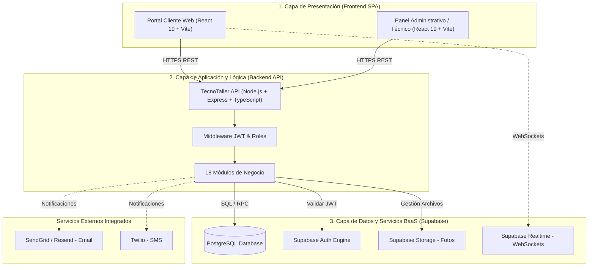

# 📖 Contexto Completo y Arquitectura del Sistema TecnoTaller / TecnoFix

Este documento presenta la **especificación integral, exhaustiva y técnica** de todo el ecosistema de software **TecnoTaller / TecnoFix**, abarcando el **Backend**, el **Frontend** y la totalidad de sus **Conexiones e Integraciones**.

---

## 1. 📌 Resumen Ejecutivo y Propósito del Sistema

**TecnoTaller (TecnoFix)** es una plataforma digital de extremo a extremo diseñada para la administración y operación de talleres de servicio técnico, reparación de dispositivos electrónicos y comercialización de repuestos y productos.

### Objetivos Clave del Negocio:
1. **Atención y Autoservicio al Cliente**: Permitir a los clientes consultar catálogos de productos y servicios, agendar citas de soporte y rastrear el avance de sus reparaciones en tiempo real mediante un código de seguimiento.
2. **Operación y Taller**: Permitir a los técnicos diagnosticar fallas, registrar insumos/repuestos utilizados, adjuntar evidencias fotográficas y cambiar estados de las órdenes de trabajo bajo una máquina de estados estricta.
3. **Gestión Administrativa**: Brindar al administrador control total sobre inventario, compras a proveedores, disponibilidad de técnicos, facturación, garantías, auditoría y reportes analíticos.

---

## 2. 🏛️ Arquitectura General del Sistema

El sistema implementa una **Arquitectura Cliente-Servidor (Client-Server)** estructurada en un modelo de **Tres Capas (Three-Tier Architecture)**:



---

## 3. ⚙️ Contexto del Backend (`tecnotaller-backend`)

### 3.1. Stack Tecnológico
* **Lenguaje & Entorno**: Node.js (>= 18), TypeScript.
* **Framework Web**: Express.js.
* **Seguridad HTTP**: Helmet (cabeceras seguras) y CORS configurable.
* **Validación de Datos**: Zod (validación estricta de esquemas en tiempo de ejecución).
* **Documentación**: OpenAPI 3.0 servida interactivamente mediante `@scalar/express-api-reference` en `/docs` y `/openapi.json`.
* **Testing**: Vitest con suites unitarias e integración.
* **Persistencia**: `@supabase/supabase-js` conectado a PostgreSQL.

### 3.2. Arquitectura de Código: Monolito Modular en Capas
El backend está organizado en `src/modules/`, donde cada funcionalidad se aísla en capas independientes:

```
[Cliente HTTP / Frontend]
        │
        ▼
   [routes.ts]        ➔ Define endpoints, rutas y aplica middlewares
        │
        ▼
 [controller.ts]    ➔ Recibe req, invoca servicio, retorna res (status HTTP)
        │
        ▼
   [service.ts]       ➔ Lógica de negocio, reglas de dominio y transiciones
        │
        ▼
 [repository.ts]    ➔ Patrón Repositorio: consultas SQL y RPC con Supabase
        │
        ▼
 [PostgreSQL / DB]
```

### 3.3. Catálogo de los 18 Módulos del Backend

| Módulo | Prefijo de Ruta Base | Propósito Principal | Tablas / RPCs Involucradas |
|---|---|---|---|
| **`auth`** | `/api/v1/auth` | Registro, autenticación, login de usuarios y emisión/validación de sesiones. | Supabase Auth (`auth.users`), perfiles. |
| **`work-orders`**| `/api/v1/work-orders` | Ciclo de vida completo de las órdenes de reparación mediante máquina de estados. | `work_orders`, `work_order_history` |
| **`products`** | `/api/v1/products` | Catálogo de productos disponibles para la venta. | `products`, `inventory_movements` |
| **`inventory`** | `/api/v1/inventory` | Control de stock físico, inventario general y movimientos. | `inventory_movements`, RPC `register_inventory_movement` |
| **`parts`** | `/api/v1/parts` | Repuestos utilizados específicamente en reparaciones. | `parts`, `work_order_parts` |
| **`diagnostics`**| `/api/v1/diagnostics` | Diagnósticos técnicos previos y cotizaciones. | `diagnostics` |
| **`photos`** | `/api/v1/work-orders/:id/photos` | Evidencias fotográficas del estado del dispositivo. | `work_order_photos`, Supabase Storage |
| **`services`** | `/api/v1/services` | Catálogo de servicios técnicos (mano de obra, limpiezas). | `services` |
| **`appointments`**| `/api/v1/appointments` | Agendamiento de citas presenciales de clientes en el taller. | `appointments` |
| **`customers`** | `/api/v1/customers` | Directorio de clientes, datos de contacto e historial. | `customers`, `profiles` |
| **`technicians`**| `/api/v1/technicians` | Perfiles de técnicos especialistas y habilidades. | `technicians`, `profiles` |
| **`technician-availability`**| `/api/v1/technicians/:id/availability` | Bloques de horario y disponibilidad semanal para citas. | `technician_availability` |
| **`purchase-requests`**| `/api/v1/purchase-requests` | Solicitudes de compra de repuestos y suministros. | `purchase_requests`, `purchase_request_items` |
| **`suppliers`** | `/api/v1/suppliers` | Gestión y directorio de proveedores comerciales. | `suppliers` |
| **`warranties`** | `/api/v1/warranties` | Cobertura y reclamación de garantías de reparaciones. | `warranties` |
| **`notifications`**| `/api/v1/notifications` | Enrutamiento de notificaciones internas y externas. | `notifications` |
| **`reports`** | `/api/v1/reports` | Métricas de ingresos, órdenes terminadas y productividad. | Vistas y agregaciones SQL |
| **`audit`** | `/api/v1/audit` | Bitácora de eventos y trazabilidad para auditoría. | `audit_logs` |

### 3.4. Componentes Transversales (`src/shared/`)
* **`middlewares/auth.ts`**:
  * Extrae el token `Bearer <token>` del header `Authorization`.
  * Valida tokens con `supabase.auth.getUser(token)`.
  * Inyecta `req.user` con `{ id, email, role }`.
  * **Soporte de Desarrollo Local**: Si `NODE_ENV === 'development'`, acepta tokens directos como `dev-admin-token` y `dev-tecnico-token` sin necesidad de conexión externa.
* **`middlewares/authorize-roles.ts`**:
  * Verifica si el rol del usuario autenticado (`administrador`, `tecnico`, `cliente`) tiene privilegios para acceder al endpoint.
* **`middlewares/validate.ts`**:
  * Valida `body`, `query` y `params` contra esquemas Zod antes de alcanzar el controlador.
* **`middlewares/error-handler.ts`**:
  * Captura errores y estandariza la respuesta JSON:
    ```json
    {
      "error": {
        "code": "BAD_REQUEST",
        "message": "Descripción clara del error",
        "details": {}
      }
    }
    ```
* **`constants/db-errors.ts`**:
  * Mapea códigos de error de PostgreSQL (`23505` Unique Violation, `23503` Foreign Key Violation, etc.) a excepciones legibles de negocio (`ConflictError`, `BadRequestError`, etc.).

---

## 4. 💻 Contexto del Frontend (`tecnofix-frontend`)

### 4.1. Stack Tecnológico
* **Framework**: React 19 con TypeScript.
* **Build Tool**: Vite.
* **Diseño y Estilos**: Tailwind CSS, Radix UI (accesibilidad y componentes modales/diálogos), Lucide React.
* **Enrutamiento**: React Router DOM v7.
* **Caché y Peticiones Asíncronas**: TanStack React Query v5.
* **Cliente HTTP**: Axios.
* **Formularios y Validaciones**: React Hook Form integrado con Zod vía `@hookform/resolvers`.

### 4.2. Estructura de Páginas y Navegación

#### 🌐 Portal Público / Cliente (`ClientLayout`)
* **`/` (Home)**: Banner principal, servicios destacados y buscador de tracking.
* **`/productos`**: Catálogo de productos con filtros por categoría, búsqueda y precio.
* **`/productos/:id`**: Vista detallada del producto y botón de compra.
* **`/carrito`**: Checkout y resumen de pedido.
* **`/servicios`**: Lista de servicios técnicos disponibles y tarifas estimadas.
* **`/agendar`**: Flujo para agendar citas presenciales seleccionando fecha, servicio y técnico.
* **`/seguimiento`**: Consulta interactiva de órdenes mediante código de seguimiento.

#### 🔐 Panel Administrativo (`AdminLayout` protegido por `<AdminRoute>`)
* **`/admin/login`**: Acceso seguro para personal autorizado.
* **`/admin/dashboard`**: Tablero de control con métricas globales, ingresos y alertas operativas.
* **`/admin/ordenes` & `/admin/ordenes/:id`**: Gestión operativa de órdenes de trabajo, visualización de diagnóstico, asignación de técnicos, cambio de estados en tiempo real y registro de costos.
* **`/admin/inventario` & `/admin/repuestos`**: Control de stock de repuestos y productos en bodega.
* **`/admin/productos` & `/admin/servicios`**: Formularios CRUD para mantener el catálogo.
* **`/admin/citas`**: Calendario administrativo de citas agendadas.
* **`/admin/clientes` & `/admin/tecnicos`**: Gestión de usuarios y asignación de disponibilidad horaria.
* **`/admin/garantias`**: Seguimiento a pólizas de garantía de equipos entregados.
* **`/admin/reportes`**: Gráficas financieras y operativas del taller.
* **`/admin/auditoria`**: Visor de logs del sistema para rastrear qué usuario realizó cada cambio.

---

## 5. 🔌 Conexiones e Integraciones en su Totalidad

```
+-------------------------------------------------------------------------------+
|                             ARQUITECTURA DE CONEXIONES                        |
+-------------------------------------------------------------------------------+

  [Frontend React (Vite:5173)]
         │
         │  1. Peticiones HTTP/REST (Axios con Header 'Authorization: Bearer JWT')
         ▼
  [Backend Express (Node:3000)]
         │
         │  2. Consultas SQL / RPC con Service Role
         ▼
  [Supabase / PostgreSQL Cloud]
         ▲
         │  3. Verificación de JWT (auth.getUser)
         ▼
  [Supabase Auth]

  [Frontend React] ───(4. WebSockets / Realtime)───► [Supabase Realtime]
  [Backend Express] ───(5. Carga de Fotos/Storage)──► [Supabase Storage Bucket]
  [Backend Express] ───(6. Notificaciones API)─────► [SendGrid / Twilio]
```

### 5.1. Conexión Frontend $\longleftrightarrow$ Backend (HTTP REST vía Axios)
1. **Instancia Centralizada (`src/api/client.ts`)**:
   * Utiliza la variable de entorno `VITE_API_URL` (por defecto: `http://localhost:3000/api/v1`).
2. **Inyección de Tokens (Request Interceptor)**:
   * Antes de enviar cualquier petición, verifica si existe un token en `localStorage.getItem('tecnofix_token')`.
   * Si existe y no es la ruta `/auth/login`, inyecta:
     ```http
     Authorization: Bearer <token>
     ```
3. **Manejo Centralizado de Expiración (Response Interceptor)**:
   * Si el backend responde con un error `401 Unauthorized`, el interceptor elimina el token almacenado y redirige al login.
4. **React Query Hooks**:
   * Toda consulta y mutación (ej. `useWorkOrders`, `useProducts`, `useCreateProduct`) pasa por React Query, administrando automáticamente reintentos, estados de carga (`isLoading`), errores y actualización inmediata de la UI mediante `queryClient.invalidateQueries()`.

### 5.2. Conexión Backend $\longleftrightarrow$ Base de Datos (Supabase / PostgreSQL)
1. **Cliente Supabase (`src/config/supabase.ts`)**:
   * Inicializado con `SUPABASE_URL` y `SUPABASE_SERVICE_ROLE_KEY`.
   * La clave `serviceRoleKey` otorga al backend privilegios administrativos para consultar tablas y ejecutar procedimientos almacenados de forma segura, evitando exponer credenciales maestras en el navegador.
2. **Procedimientos Almacenados (RPC)**:
   * Se ejecutan transacciones atómicas directamente en la base de datos (por ejemplo, `register_inventory_movement`) para asegurar que una salida de inventario descuente stock de forma consistente sin riesgo de condiciones de carrera (*race conditions*).

### 5.3. Conexión de Autenticación (Supabase Auth)
1. El frontend envía credenciales de login al backend (`/api/v1/auth/login`).
2. El backend autentica contra Supabase Auth y retorna el access token JWT junto con el rol del usuario (`administrador`, `tecnico`, `cliente`).
3. En cada petición subsiguiente, el backend verifica el token mediante `supabase.auth.getUser(token)` para validar que el usuario no esté bloqueado o su token invalidado.

### 5.4. Conexión en Tiempo Real y Almacenamiento de Archivos
* **Supabase Realtime**: El frontend puede suscribirse directamente a cambios en la tabla `work_orders` para actualizar la vista de tracking del cliente en el momento exacto en que un técnico avanza una orden.
* **Supabase Storage**: Las fotos de diagnósticos y entregas se cargan en buckets protegidos de Supabase Storage; en la base de datos se almacenan las referencias y URLs firmadas.

---

## 6. 🚀 Resumen del Entorno de Ejecución Local

| Servicio | Comando de Inicio | URL / Puerto |
|---|---|---|
| **Backend API** | `npm run dev` | `http://localhost:3000` |
| **Documentación API** | *(Disponible al levantar el backend)* | `http://localhost:3000/docs` |
| **Frontend Web** | `npm run dev` (dentro de `tecnofix-frontend`) | `http://localhost:5173` |
| **Pruebas Backend** | `npm test` o `npm run test:unit` | Vitest Runner |
