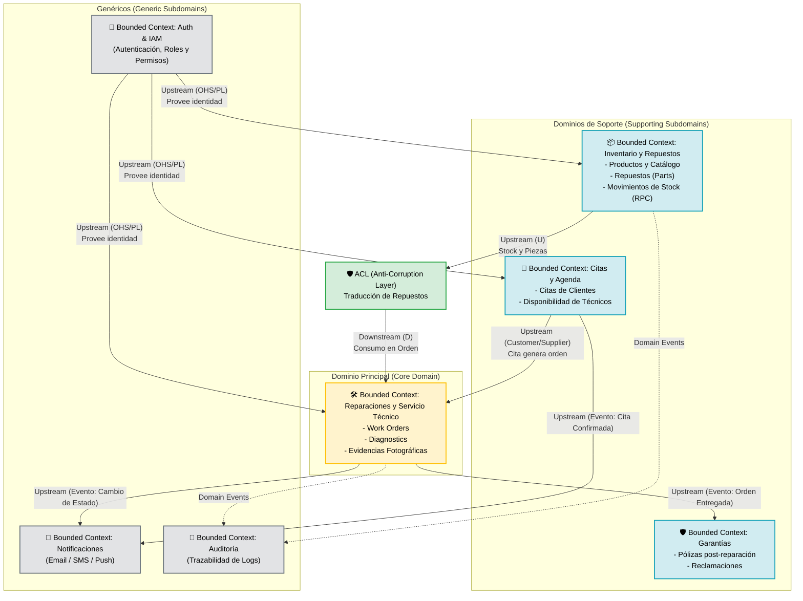
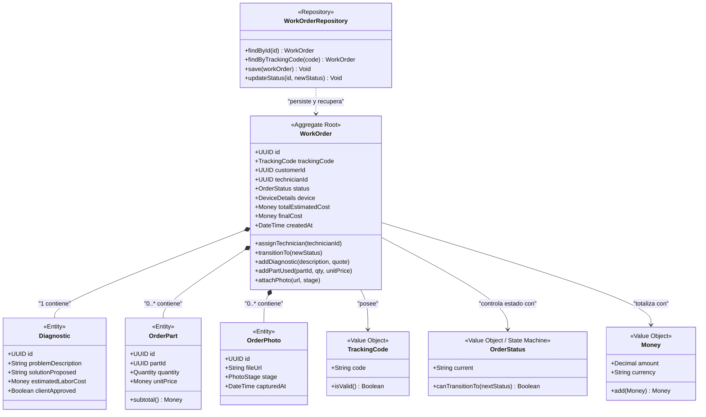

# 🧩 Diseño Dirigido por el Dominio (DDD) - TecnoTaller / TecnoFix

Basado en los fundamentos de **Domain Driven Design (DDD)** explicados en la guía de referencia (Enfoque en el dominio, Lenguaje Ubicuo, Bounded Contexts, Agregados, Value Objects, Repositorios y Context Mapping).

---

## 1. 🗺️ Mapa de Contextos Delimitados (Bounded Contexts & Context Map)

En DDD, un **Bounded Context** delimita las fronteras conceptuales donde un término tiene un significado estricto e inequívoco.

### 🤝 Relaciones entre Contextos (Patrones DDD de la Infografía):
1. **Upstream (U) / Downstream (D)**:
   * `Auth` es **Upstream**: provee tokens y claims a los demás módulos.
   * `Work Orders` es **Downstream** respecto a `Auth` y `Citas`.
2. **Anti-Corruption Layer (ACL)**:
   * El módulo de **Reparaciones** no acopla directamente su modelo interno al modelo de inventario físico. Usa una capa **ACL** para solicitar y reservar repuestos sin contaminar el dominio de reparación.
3. **Open Host Service (OHS) / Published Language (PL)**:
   * `Auth` expone un servicio abierto estandarizado basado en JWT y contratos TypeScript compartidos.
4. **Customer / Supplier (C/S)**:
   * El contexto de **Citas** actúa como proveedor que alimenta el flujo de recepción de **Reparaciones**.

---

## 2. 🎯 Modelo Táctico DDD: Bounded Context de Reparaciones (Core Domain)

Siguiendo el ejemplo práctico de la infografía (Cliente $\rightarrow$ Pedido $\rightarrow$ Línea de Pedido $\rightarrow$ Total $\rightarrow$ Repositorio):

---

## 3. 🧠 Conceptos Fundamentales Aplicados al Sistema

| Concepto DDD | Elemento en TecnoTaller | Justificación |
|---|---|---|
| **Entidad (Entity)** | `Diagnostic`, `OrderPart`, `OrderPhoto` | Tienen un identificador único (UUID) y su estado cambia en el tiempo, pero existen subordinadas a la orden de trabajo. |
| **Objeto de Valor (Value Object)** | `TrackingCode`, `Money`, `OrderStatus`, `Quantity` | Son **inmutables** y se definen por sus atributos, no por su identidad. Por ejemplo, dos instancias de `Money(50, 'USD')` son idénticas e intercambiables. |
| **Raíz del Agregado (Aggregate Root)** | `WorkOrder` | Es la puerta de entrada única. Ninguna entidad externa puede modificar una `OrderPart` o un `Diagnostic` sin pasar por los métodos de control de `WorkOrder`. Asegura la consistencia del conjunto. |
| **Agregado (Aggregate)** | `[WorkOrder + Diagnostic + OrderParts + Photos]` | Se tratan como una sola unidad transaccional. Al guardar o cambiar de estado, se validan todas las reglas globales del conjunto. |
| **Repositorio (Repository)** | `WorkOrderRepository` (`work-orders.repository.ts`) | Encapsula el acceso a la base de datos (PostgreSQL/Supabase) y devuelve entidades y agregados de dominio limpios, ocultando el SQL y las consultas CRUD. |
| **Lenguaje Ubicuo (Ubiquitous Language)** | Términos de negocio unificados | Todos (código, base de datos, frontend y taller) usan exactamente los mismos términos: `received`, `diagnosing`, `waiting_parts`, `completed`, `delivered`, `tracking_code`. |

---

## 4. 📋 Reglas de Negocio del Agregado de Reparaciones

1. **Invariante de Diagnóstico**:
   * Una orden no puede pasar a estado `IN_PROGRESS` ni `APPROVED` sin antes haber registrado un `Diagnostic` con costo estimado.
2. **Cálculo Consistente de Costo**:
   * $\text{Costo Total} = \sum (\text{OrderPart.subtotal}) + \text{Diagnostic.estimatedLaborCost}$.
3. **Control de Transiciones (State Pattern)**:
   * Solo se permiten transiciones válidas:
     $$\text{RECEIVED} \rightarrow \text{DIAGNOSING} \rightarrow \text{PENDING\_APPROVAL} \rightarrow \text{IN\_PROGRESS} \rightarrow \text{COMPLETED} \rightarrow \text{DELIVERED}$$
4. **Registro de Trazabilidad**:
   * Cada cambio de estado en `WorkOrder` dispara automáticamente una entrada en el historial de auditoría y notifica al cliente si corresponde.
